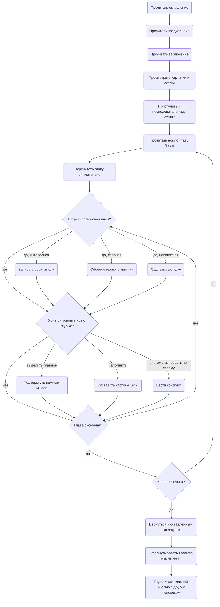

# Как читать книги с пользой (схема):

```mermaid
flowchart TD;
    A(Прочитать оглавление);
    A --> B(Прочитать предисловие);
    B --> C(Прочитать заключение);
    C --> D(Просмотреть картинки и схемы);
    D --> E(Приступить к последовательному чтению);
    E --> F(Прочитать новую главу бегло);
    F --> G(Перечитать главу внимательно);
    G --> H{Встретилась новая идея?};
    H --> |да, интересная| I(Записать свои мысли);
    H --> |да, спорная| J(Сформулировать критику);
    H --> |да, непонятная| K(Сделать закладку);
    H --> |нет| L{Хочется усвоить глубже?};
    I --> L{Хочется yсвоить идею глубже?};
    J --> L{Хочется yсвоить идею глубже?};
    K --> L{Хочется yсвоить идею глубже?};
    L --> |выделить главное| M(Подчеркнуть важные мысли);
    L --> |запомнить| N(Составить карточки Anki);
    L --> |систематизировать по-своему| O(Вести конспект);
    L --> |нет| P{Глава окончена?};
    M --> P{Глава окончена?};
    N --> P{Глава окончена?};
    O --> P{Глава окончена?};
    P --> |нет| H{Встретилась новая идея?};
    P --> |да| Q{Книга окончена?};
    Q --> |нет| F(Прочитать новую главу бегло);
    Q --> |да| S(Вернуться к оставленным закладкам);
    S --> T(Сформулировать главную мысль книги);
    T --> U(Поделиться главной мыслью с другим человеком);
```
