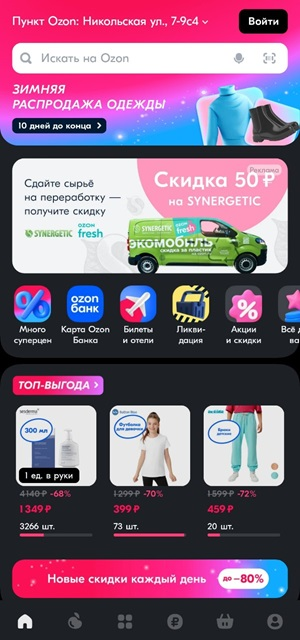

# Ozon App home screen

The Ozon App home screen presents a modern and colorful interface. It is designed to attract the attention of the customer.

At the top, the delivery address is displayed beside the login button. The search bar is located below the delivery address. The application supports text, voice, and barcode search, as depicted by the buttons in the search bar.

Below the search bar, promotional banners showcase current deals and featured products. At the moment, they convey information regarding the ongoing winter clothing sale. Next to it is an advertisement for a certain brand's discount in exchange for recycling.

The category navigation list provides the illustrative icons leading to the Ozon offers, such as "Top Prices," "Ozon Bank Card," "Tickets and Hotels," "Discounts," and many more.

The Top Benefit section displays a dynamically updated section with a list of the best offers. The best offers are selected for the current user using Ozon's recommendation algorithm.

The footer contains quick links to the available application sections, such as "Ozon," "Fresh," "Catalog," "Shopping Cart," and "Account Settings."

The Ozon application design prioritizes user-friendly navigation, product visibility, and efficient checkout processes, creating a seamless and enjoyable online shopping experience.
